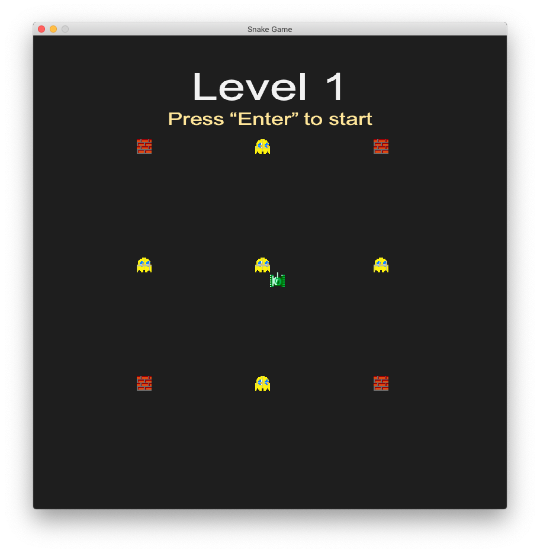
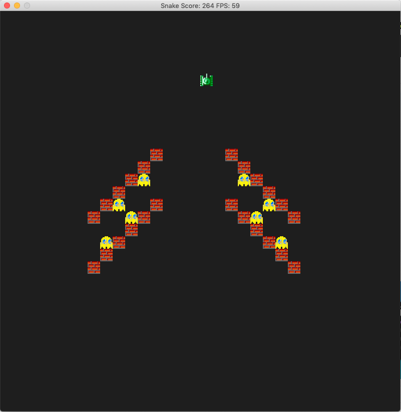

# CPPND Capstone Project -- A New Snake Game

Starting from the starter code for the Capstone project in the [Udacity C++ Nanodegree Program](https://www.udacity.com/course/c-plus-plus-nanodegree--nd213), created levels in the game and gave it a new look. 

## Dependencies

Needs the following:
* cmake >= 3.7
* make >= 4.1 (Linux, Mac), 3.81 (Windows)
* SDL2 >= 2.0
* SDL2_image >= 2.0
* gcc/g++ >= 5.4

In Udacity Project Workspace, include the following lines in .student_bashrc will met the above dependencies:

`apt-get update`

`sudo apt-get -y install libsdl2-dev`

`sudo apt-get -y install libsdl2-image-dev`

## Basic Build Instructions

1. Clone this repo.
2. Make a build directory in the top level directory: `mkdir build && cd build`
3. Compile: `cmake .. && make`
4. Run it: `./SnakeGame`

## Game Instructions

There're a total of 5 levels. At the beginning of each level, press enter to start the game. Use arrow keys to control movement of the tank(s) and hit all the yellow ghosts to complete the level. Complete all 5 levels without hitting the wall or your own tank to win the game. 

## Code structures

* **main.cpp**: main codes to decide game window properties and create game objects
* **snake.h, snake.cpp**: define property and rule for snake
* **game.h, game.cpp**: define and control the game loop; define level properties from level configuration files in levels/
* **renderer.h, renderer.cpp**: display game window and instruction information

## Project Rubric

The project met the following project rubric (total 10 items + required)
1. All required README criteria
2. Compiling and Testing criteria (See above for Dependencies and Build instructions)
3. All Loops, Functions, I/O criteria (3 items)
4. OOP criteria (5 items): The project uses Object Oriented Programming techniques; Classes use appropriate access specifiers for class members; Class constructors utilize member initialization lists; Classes abstract implementation details from their interfaces; Classes encapsulate behavior; 
5. Memory Management criteria (2 items): The project makes use of references in function declarations; The project uses scope / Resource Acquisition Is Initialization (RAII) where appropriate; 
